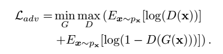
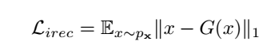
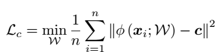
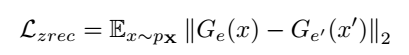

Anomaly Detection By One Class Latent Regularized Networks
==========================================================

* ### *논문에서 제시된 아이디어 정리 (3-5줄 이내)*   
  기존 GAN과 Autoencoder 구조를 개선하여 모델이 normal data에 대한 latent feature를 제대로 뽑게 하여 
  그 동안 학습 process에서 발생했던 G와 D 사이의 불균형 문제를 해소 시켜 Normal data에 대한 recon'을 잘하도록 개선하였음.

* ### *다음 질문의 대한 답변 작성*   
  ###### (1) 저자가 뭘하고 싶은건지?
  저자는 어떻게 하면 안정적인 학습 과정 속에서 normal과 abnormal data 사이의 latent representation feature에 대한 차이점을 잘 분리 시키길 원함.

  ###### (2) 연구에서 제시된 중요한 접근 요소는 무엇인가?
  기존 normal data의 feature를 제대로 학습 하기 위해 dual encoder(main + auxiliary) 구조와 normal data의 feature를 아우르는 hypersphere를 만들어
  main encoder가 더 normal feature를 잘 catch할 수 있도록 하는 latent regularizer를 가지고 학습의 안정성을 추구함.

  ###### (3) 모델의 loss의 의미를 정확히 이해했는지?
* (1) adversarial loss   
     
   
* (2) image reconstruction loss   
     
   
* (3) center distance loss   
  data들의 feature들의 중앙값(C)들의 평균을 구한 후, 샘플이 들어 오면 비슷한(normal) 샘플은 C에 가깝게 위치하고, 
  특이한(abnormal)한 샘플이 오면 hypersphere 밖에 위치함. 만약 밖에 위치한 샘플은 더 가중치를 두어 중심에서 더 멀어지도록 만듬.
    
  
    
* (4) latent representation loss   
   오로지 target 샘플을 가지고 auxiliary encoder가 latent z를 x'에 대해서 더 잘 복원하도록 하게 하며,  
   latent regularizer가 latent feature space 상의 확률 분포 왜곡을 일으킬 수 있으므로, input image와 generated image 사이의 거리를
   최소화하는 loss를 추가하여 방지함.
    
  

  ###### (4) 결론 정리
  * 이 논문을 통해서 학습 데이터의 기본 구조가 latent feature space에서 더 잘 포착되도록 하였으며, 불안정한 학습을 가져오고, GAN의 기본 능력을
    방해했던 Generator와 discriminator의 불균형을 개선하기 위해 auxiliary encoder를 discriminator로 추가하여 더 좋은 균형을 이루어냄.
