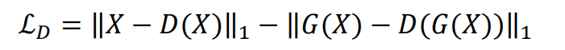
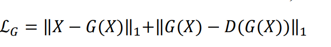

Anomaly Detection with Adversarial Dual Autoencoders
====================================================

* ### *논문에서 제시된 아이디어 정리 (3-5줄 이내)*    
  * 기존에 anomaly detection에서 사용되어 왔던 GAN 기반의 구조를 autoencoder 두 개를 이어 붙여 
    앞 단에 오는 autoencoder를 generator로 뒷 단에 오는 autoencoder를 discriminator로 사용하여 학습을 진행함.

* ### *다음 질문의 대한 답변 작성*   
  ###### (1) 저자가 뭘하고 싶은건지?
  * 기존에 오직 GAN 기반으로 학습하여 사용한 Anomaly Detection 모델의 경우, 고질적인 문제인 학습 불안정 및 예상하기 힘든 점을 집어
    이 부분을 보완하고자, 두개의 autoencoder 중 하나는 G의 역할을, 나머지 하나는 D의 역할을 하여 본 task를 수행하게끔 함.

  ###### (2) 연구에서 제시된 중요한 접근 요소는 무엇인가?
  * GAN 기반 학습의 불안정성을 보완하고, 특히 tumor detection에 대한 다양한 복잡성을 지닌 dataset에 대한 다양한 실험을 통해 
    다양한 시나리오에서 사용할 수 있는 강력한 모델이 만들어질 수 있음을 보여줌.
  
  ###### (3) 모델의 loss의 의미를 정확히 이해했는지? 
  * Discriminator loss
  
  
  * Generator loss
  
  
  위 두 loss는 각 autoencoder에서 나온 값 (D(X), G(X))과 원본 이미지 X와의 비교, 즉 Reconstruction Error를 계산하고
  나중에는 생성된 이미지 x^hat을 가지고 anomaly score를 계산함.

  ###### (4) 결론 정리
  * 본 연구에서는 두 개의 autoencoder를 각각 G,D로 사용하는 Anomaly detection을 위한 GAN 기반 방법을 도입함. 
    또한 더 나은 탐지를 위해 recon' error를 anomaly score로 활용함. 뇌종양 검출의 실제 사용 사례뿐만 아니라 MNIST와 CIFAR-10 모두에서
    좋은 결과를 보임.
