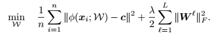

Deep One Classification
=======================

* ### *논문에서 제시된 아이디어 정리 (3-5줄 이내)*    
  기존 SVDD에서 제시하는 Kernel function을 통해서 feature space에서 정상 데이터를 둘러싸는 중심이 C인 가장 작은 구의 경계를 찾는 것에서
  Kernel function을 neural network로 대체하여 정상 feature를 뽑도록 하여 정상 데이터를 둘러싸는 중심이 C인 가장 작은 구를 찾는 걸
  목표로 함.

* ### *다음 질문의 대한 답변 작성*   
  ###### (1) 저자가 뭘하고 싶은건지?
  * 위에서 설명한 것처럼 기존 SVDD에서 Kernel function를 대신한 neural network로 바꾼 후 정상 데이터를 아우르는 가장 작은 구를
  찾아 정상과 비정상을 구별하는 이상치 탐지 모델을 만들고자 함.
  
  ###### (2) 연구에서 제시된 중요한 접근 요소는 무엇인가?
  * Kernel 기반 SVDD 처럼 hypersphere의 볼륨 R^2을 최소화하면서 두번째 항에서 hypersphere 바깥에 있는 데이터에 대해 패널티를 가함.
    그렇게 해서 정상인 데이터와 비정상인 데이터의 구별을 좀 더 쉽게 만듬.
  
  ###### (3) 모델의 loss의 의미를 정확히 이해했는지?
  * One Class Deep SVDD Objective loss
    
  
    
  위에서 언급한 것을 수식으로 풀어쓴 함수로 첫번째 항을 보면 데이터의 feature representation과 중심 c와의 거리를 직접적으로 최소화하는 것을
  알 수 있음. 그리고 데이터를 중심 c의 가깝게 mapping 하도록 데이터의 공통된 feature를 잘 추출하도록 만듬.

   ###### (4) 결론 정리
   * 이전까지의 Anomaly detection 분야는 주로 SVM이나 SVDD과 같은 전통적인 방법을 통해 해결하였으나 deep neural network를 통해서
     anomaly detection 문제를 해결하고자 하였음.

 