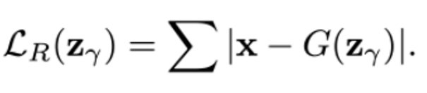
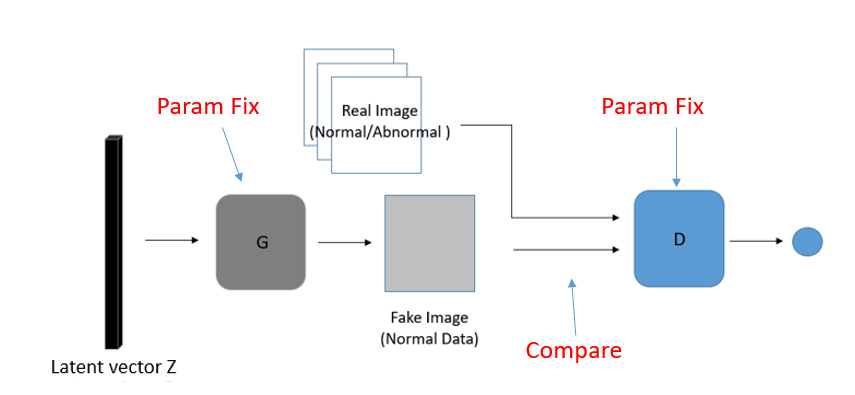
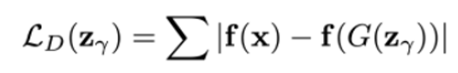
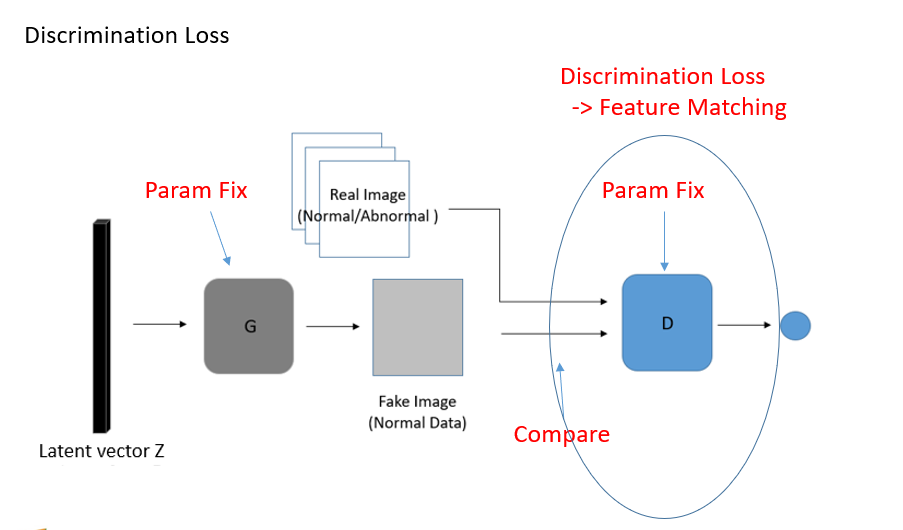

Unsupervised Anomaly Detection with Generative Adversarial Networks to Guide Marker Discovery
=============================================================================================

* ### *논문에서 제시된 아이디어 정리 (3-5줄 이내)*   
  GAN 모델을 normal data로만 학습하여 만약 abnormal한 data가 들어오면 generator가 생성한 이미지와 입력 이미지 간의 recon' error
  를 최종 anomaly score로 사용하여 그 score가 높을수록 입력 이미지가 비정상임을 증명하려 함.

* ### *다음 질문에 대한 답변 작성*
  ###### (1) 저자가 뭘하고 싶은건지?
  * 여러가지 병변들이 존재하지만 이 병변이 정확히 어떤 병변인지 알려주는 게 아닌, 이 이미지에서 정확히 무슨 질병을 보유하는 지는 모르지만
    정상 데이터 같지는 않다라고 알려주고 어느 부분을 보고 그렇게 생각하는지 detection 해주는 모델을 만들고자 함.
  
  ###### (2) 연구에서 제시된 중요한 접근 요소는 무엇인가?
  * generator를 학습할 때 normal한 이미지만 사용하여 normal data의 manifold를 학습할 수 있도록 함.
    특히, 입력 이미지와 G에서 생성한 이미지를 discriminator에 넣고 중간 activation function 계층의 값을 가지고 discrimination loss를 측정함.   
    즉, feature matching 같은 기법으로 nash equalibrium 상태를 좀 더 잘찾도록 함.
  
  ###### (3) 모델의 loss의 의미를 잘 이해했는지? 
  * Residual loss
    
  
    
  residual loss의 과정
    
  
    
  * discrimination loss
    
  
    
  * discrimination loss의 과정 설명
    
  
  
  ###### (4) 결론 정리
  * normal data를 DCGAN으로 학습시킨 후, z를 Random Sampling한 후, normal data와 비슷하게 가기 위해 계속 학습 업데이트를 진행함.
    어느정도 학습이 완료되면 Zn으로부터 query data x가 잘 만들어지는지 확인하고 normal, abnormal 판단 하고 abnormal한 이미지를 시각화함.