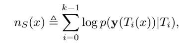
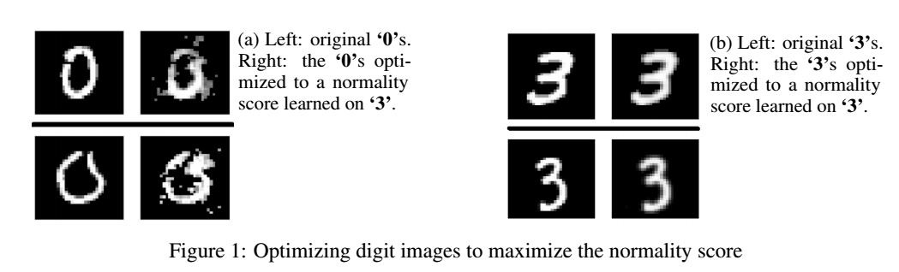

Deep Anomaly Detection Using Geometric Transformations
======================================================

* ### *논문에서 제시된 아이디어 정리 (3-5줄 이내)*   
  * 입력 이미지에 대해서 기하학적인 transformation(flip, rotate 등)을 적용한 self labeled 데이터로   
    classifier를 학습시키고 classifier가 매긴 score값으로 정상, 비정상을 판단함.

    
* ### *학습 코드 링크 첨부*   
  * https://github.com/izikgo/AnomalyDetectionTransformations

* ### *다음 질문의 대한 답변 작성*   
  ###### (1) 저자가 뭘하고 싶은건지?
  * 저자가 본 논문을 통해서 normal data를 기하학적으로 변환시킨 결과물을 가지고 classifier가   
    이미지에 적용된 transformation이 무엇인지 잘 구분하도록 학습하면 정상 데이터의 뚜렷한 feature를 얻고자 함.

  ###### (2) 연구에서 제시된 중요한 접근 요소는 무엇인가?
  * 논문에서 정의한 문제에서 h_S (x)를 supervised learning으로 직접적으로 학습시키는 것이 아닌   
    classifier가 score를 내는 function을 제대로 고안하여 이 function의 threshold에 따른 score(n_S (x))를 잘 구하는 것을
    목표로 함. 그래서 입력 x1, x2에 대해 n_S(x1) > n_S(x2) 이라면 x1이 x2에 비해 더 정상이라고 고려함.
  
  ###### (3) 모델의 loss의 의미를 정확히 이해했는지?
   * 이미지에 적용한 transformation T_i에 대해 Ti(x)에 대한 로그 최대 가능도를 더한 값으로 정의함   
     -> 모델이 도출한 각 transformation에 대한 예측값 __(softmax 값들 중 최댓값에 대한 확률분포를 구한다.)__에 대해 
        실제 label과의 차이를 계산함. 그렇게 나오는 오차를 줄여 나가는 방식으로 학습을 진행함.
   * 추가로 dirichlet 분포를 사용하여 효율적으로 로그 최대 우도법을 도출하도록 함.   
   </img>

   ###### (4) 결론 정리   
   * 일단 기하학적인 변환이 아닌 가우시안 blur, sharpening 같은 방법은 오히려 성능이 저하됨.   
  -> 즉, 모델이 이미지의 중요한 feature를 망각함.
   * 기하학적인 transformation이 정상 이미지의 feature를 유지하면서 classifier가 상대적으로 예측하기 쉽도록 조합 가능하다라는 생각을 함.
   * 마지막으로 높은 n_S값이 정상 데이터임을 보장하는지 실험을 통해 알아봄. 
     
       
   위 그림과 같이 (a)에서 0dl n_S을 높이기 위해 정상 3과 비슷한 모양으로 변한 것을 확인 가능함. 반대로 (b) 부분에서는
   3이 높은 n_S를 가지는 feature를 가지고 있어 거의 변하지 않은 것을 확인해볼 수 있다. 즉, classifier가 정상 데이터에 관련된
   feature를 잘 학습 했음을 알 수 있음.
