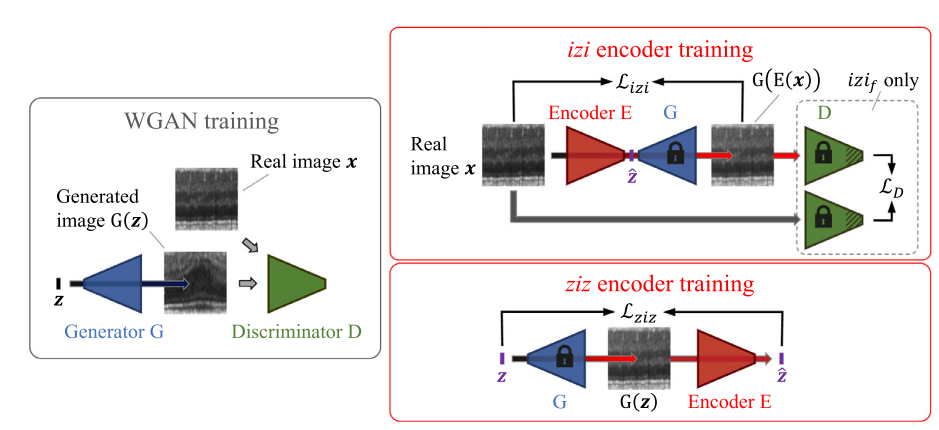
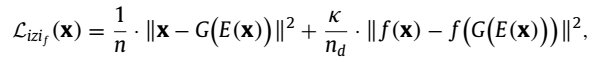

f-AnoGAN
====================

* ### *논문에서 제시된 아이디어 정리 (3-5줄 이내)*    
  * AnoGAN에서 제시한 normal data로만 GAN을 학습하고 추가로 latent space에서 병변 유무를 확인해야할 영상의 fast mapping 기술을 도입하여
    제안함. latent space mapping은 encoder를 기반으로 이루어지고 마찬가지로 discriminator feature matching과 recon' error를 포함하여
    학습을 진행함.

* ### *학습 코드 링크 첨부*   
  * https://github.com/tSchlegl/f-AnoGAN

* ### *다음 질문의 대한 답변 작성* 
  ###### (1) 저자가 뭘하고 싶은건지?
  * 기존 AnoGAN은 학습 이미지 크기가 작으면 효율적이고 빠르게 진행되지만, 이미지 사이즈가 크면 클수록 그만큼 많은 정보를 고려해야하므로
    random iteration하며 학습을 하는 AnoGAN 방법은 제대로 mapping이 잘 안되는 경우가 종종 일어남. 따라서 autoencoder에서 아이디어를
    차용해서 encoder만 가져와 image를 latent space에 mapping하는 모델로 사용함.
  
  ###### (2) 연구에서 제시된 중요한 접근 요소는 무엇인가?
  * 제안한 방법 2개 ziz, izi 방법을 통해 뭐가 더 나은지 비교하였음. ziz 방법은 학습 중에 latent space Z로부터 random하게 sampling된 샘플
    을 fixed weight G를 통해 다시 mapping 되고 encoder는 또 다시 latent space Z에 mapping하도록 훈련함. 이에 따라 ziz architecture
    는 GAN 학습할 때 사용했던 normal image data가 필요하지 않음.   
     
    izi는 real image에서 latent space Z로 encoding되어 mapping하는 과정은 encoder로 수행되고 encoding한 latent space Z를 다시 image로 
    다시 mapping 하는건 가중치가 고정된 generator 모델에서 이루어진다. 단점은 query image가 latent space Z에서 정확히 어디에 위치하는지 izi에서는
    알 수 없음. 따라서 image로 다시 mapping 하고 image to image residual loss를 계산하여 image to z mapping의 정확도를 간접적으로 측정할 수 밖에
    없다.
     
  * izif 구조는 izi의 문제점을 개선한 구조로써, discriminator의 중간 계층의 feature map에 추가로 residual loss를 사용함.
    
  

  ###### (3) 모델의 loss의 의미를 정확히 이해했는지?
  * 이 논문에서 핵심인 izif의 total loss
    
  
    
   수식을 보면 AnoGAN에서 사용된 feature matching에서 쓴 residual loss와 생성된 image와 input image 사이의 recon' error를 가중 합
   한 loss를 가지고 학습에 적용함.
  
  ###### (4) 결론 정리
  * gan 모델은 AnoGAN과 달리 WGAN을 사용하고 3가지 encoder 기반 학습 방법론를 제시하고 그 중에서 izif 방법론을 통해서 생성한 image와 input
    image 간의 recon' error를 줄여나가는 방식으로 만약 기존에 normal data로 학습한 generator에 abnormal한 이미지가 들어오면 제대로 복원
    하지 못해 생기는 recon' error 값으로 anomaly score를 계산함. 그래서 anomaly score가 크면 클수록 abnormal 하다고 판단할 수 있음.

  
    